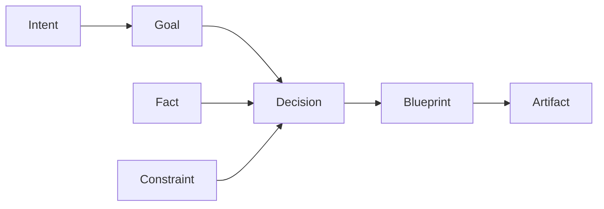

# VCOS Энциклопедия

> **Единый источник архитектурной истины.**  
> Создана: 3 июля 2026  
> Источник: дизайн-сессии 150–192, спецификации CO-001, CM-001, CA-001, CP-001  
> Статус: **Architecture Freeze** — никакие изменения архитектуры не допускаются

---

## Содержание

1. [Генезис VCOS](#1-генезис-vcos)
2. [Фундамент (000-foundation)](#2-фундамент-000-foundation)
3. [Четыре столпа стандарта](#3-четыре-столпа-стандарта)
4. [Core Ontology — CO-001](#4-core-ontology--co-001)
5. [Canonical Model — CM-001](#5-canonical-model--cm-001)
6. [Core Algebra — CA-001](#6-core-algebra--ca-001)
7. [Core Protocols — CP-001](#7-core-protocols--cp-001)
8. [Domain Packs](#8-domain-packs)
9. [Архитектурные открытия](#9-архитектурные-открытия)
10. [Жёсткие правила](#10-жёсткие-правила)
11. [Карта документов 150–192](#11-карта-документов-150-192)
12. [Глоссарий ключевых терминов](#12-глоссарий-ключевых-терминов)

---

## 1. Генезис VCOS

### 1.1 Откуда всё началось

VCOS родился из проекта **Prompt Architect 3.0** (док 150) — концепции специализированного агента на базе Hermes. Изначальная идея: не генератор промптов, а **система проектирования сцены**.

**Ключевой сдвиг** (док 155):  
Intent — это не анкета с полями, а **когнитивная модель намерения**.  
Три уровня: `Request → Intent → Desired Impact`.

**Reasoning Engine** (док 159):  
Не LLM, а **алгоритм**. LLM — только исполнитель.  
Reasoning Engine строится как цепочка модулей:
```
Context Builder → Intent Modeling → Hypothesis Generator → 
Knowledge Expansion → Gap Analyzer → Decision Planner →
Interview Planner → Creative Workspace → Creative Reasoner →
Consistency Validator → Scene Blueprint → Prompt Renderer
```

### 1.2 Эволюция: от агента к стандарту

| Этап | Доки | Что произошло |
|------|------|---------------|
| **Концепт** | 150–154 | Prompt Architect 3.0, Scene Spec, Domain Model |
| **Когнитивное проектирование** | 155–159 | Intent как модель мышления, Reasoning Engine |
| **Архитектура платформы** | 160–165 | RFC, Kernel vs Static, Architecture Invariants |
| **Meta Model** | 166–168 | Canonical Language, Understanding > State |
| **Sprint 0** | 170–174 | Canonical Model, CO-001, Тесты (неизбежность, универсальность) |
| **Инженерия** | 175–179 | Workspace, GS-001, Architecture Freeze |
| **Спецификации** | 180–189 | CO-001 v1.0, Review, 4-документное ядро, CM-001 |
| **Финальные открытия** | 190–192 | Semantic Graph, Domain Independence, финальная структура |

### 1.3 Ключевые поворотные моменты

- **Док 163**: Переход от исследований к инженерному проектированию. Architecture Invariants v0.1.
- **Док 167**: Остановка проектирования документов → проектирование **языка платформы**.
- **Док 168**: Отказ от DesignState. Система вычисляет **Understanding**, а не State.  
  `State → State` заменено на `Understanding → Better Understanding`.
- **Док 170**: Vision VCOS — открытый стандарт когнитивного проектирования.
- **Док 172**: **Ontology Reduction** — сокращение примитивов с 12 до 7 через "Тест неизбежности".
- **Док 175**: Workspace как единица работы (не Project, не Scene, не DesignState).
- **Док 176**: Осознание трёх уровней: Исследование → Стандарт → Реализация. Начало GS-001.
- **Док 179**: **"Архитектурная фаза закончена. ВСЁ. Точка."** — остановка Architecture Astronaut'ства.
- **Док 182**: Финальная структура ядра: **CO-001 + CM-001 + CA-001 + CP-001**.
- **Док 183**: Документы = контракты, а не описания. Contract-First.
- **Док 190**: **Semantic Graph** как истинное ядро Hermes. ProjectModel → Semantic Graph.

---

## 2. Фундамент (000-foundation)

Неизменяемые документы, которые больше никогда не переписываются.

### 2.1 Vision

> VCOS — открытый стандарт когнитивного проектирования, который преобразует человеческое намерение в формальную модель проекта, а затем компилирует её в артефакты для различных генеративных систем.

Ни слова про промпты, GPT, изображения. Это уровень стандарта.

### 2.2 Architecture Invariants

Правила, которые **никогда** нельзя нарушать:

| # | Инвариант | Суть |
|---|-----------|------|
| I-001 | **Model Agnosticism** | Core Ontology не зависит от генеративной модели |
| I-002 | **Prompt Is Compilation** | Промпт — результат компиляции, не проектирования |
| I-003 | **Separation of Concerns** | Каждый агент — одна область знаний |
| I-004 | **Decision-Driven State** | Всякое изменение графа — следствие Decision |
| I-005 | **Knowledge Immutability from Artifacts** | Artifact не меняет Knowledge |
| I-006 | **Domain Boundary** | Domain Packs не меняют Core Ontology |
| I-007 | **Renderer Purity** | Renderer не создаёт Decisions |
|| I-008 | **Graph-First Communication** | Все компоненты общаются через Semantic Graph |
|| I-009 | **Intent Integrity** | Intent не изменяется агентами после фиксации |
|| I-010 | **Cognitive Primitive Minimalism** | Core Ontology содержит только когнитивные примитивы; Camera, Scene, Lighting — Domain Packs |

### 2.3 Computational Theory

Система вычисляет не промпт и не изображение.  
**Результат вычислений — Understanding.**  
Архитектура: `Transformer(SemanticGraph) → SemanticGraph` (Encyclopedia §6.2).

> **Замечание:** В оригинальной спецификации CP-001 §4.1 указано `(ProjectModel, params) → ProjectModel'`, 
> но финальная архитектура (док 190, Encyclopedia §9.2) утверждает Semantic Graph как истинное ядро. 
> Phase 3 (3 июля 2026) окончательно зафиксировала `SemanticGraph → SemanticGraph`.

### 2.4 Design Principles

| # | Принцип | Суть |
|---|---------|------|
| DP-01 | **Минимальное ядро** | Минимум сущностей, никаких «полезно добавить» |
| DP-02 | **Domain Independence** | Kernel не знает доменов |
| DP-03 | **Semantic Only** | Храним только семантику, не рантайм |
| DP-04 | **Composition over Inheritance** | Агрегация, не наследование |
| DP-05 | **Contract-First** | Спецификация = контракт, не описание |

---

## 3. Четыре столпа стандарта

Финальная структура ядра VCOS Standard (утверждена в док 182):

```
VCOS Standard/
├── CO-001 — Core Ontology     (ЧТО существует)
├── CM-001 — Canonical Model   (КАК представлено)
├── CA-001 — Core Algebra      (ЧТО можно делать)
└── CP-001 — Core Protocols    (КАК компоненты взаимодействуют)
```

**Тест правильности:**  
*"Если завтра исчезнет Hermes, смогу ли я по этим четырём документам написать новую реализацию?"*

---

## 4. Core Ontology — CO-001

**Ответ:** *«Что существует во вселенной VCOS?»*

### 4.1 Семь фундаментальных сущностей

| # | Сущность | Определение |
|---|----------|-------------|
| 1 | **Intent** | Исходное намерение инициатора. Существует до решений. Может быть неполным/противоречивым. |
| 2 | **Goal** | Желаемый результат. Определяет направление, не способ. Вычисляется из Intent. |
| 3 | **Constraint** | Ограничение, которое сужает пространство поиска. |
| 4 | **Fact** | Атомарная единица информации. Неделима. Подтверждена или принята. |
| 5 | **Decision** | Архитектурное решение, изменяющее граф. Всегда обосновано Goal или Fact. |
| 6 | **Blueprint** | Формальная модель решения. Результат проектирования. |
| 7 | **Artifact** | Результат компиляции. Выходные данные (промпт, JSON, изображение). |

### 4.2 Принципы CO-001

- **P-001 Minimal Core**: Минимальное количество сущностей
- **P-002 Domain Independence**: Нет Camera, Scene, Character, Prompt
- **P-003 Semantic Independence**: Смысл ≠ способ хранения
- **P-004 Extensibility**: Новые домены — только через сущности Core

### 4.3 Что НЕ входит в Core Ontology

Camera, Scene, Character, Typography, Composition, Lighting, Prompt, Image, Video — всё это принадлежит Domain Packs.

---

## 5. Canonical Model — CM-001

**Ответ:** *«Как сущности CO-001 представлены в системе?»*

### 5.0 Semantic Graph Model

**Semantic Graph — вычислительное ядро VCOS.** Это логическая модель: направленный мультиграф, где узлы — сущности CO-001, а рёбра — отношения между ними.



**Два уровня SSOT (Single Source of Truth):**

| Уровень | Сущность | Роль |
|:--------|:---------|:-----|
| **Логический** | **Semantic Graph** | Вычислительная модель. Определяет: какие узлы есть, как они связаны, какие операции допустимы. |
| **Физический** | **Registry** | Механизм хранения. Хранит Node и Edge, обеспечивает CRUD, индексацию, поиск. |

**Правило:** Semantic Graph и Registry — не конкуренты, а два представления одной истины. Semantic Graph определяет **ЧТО** мы вычисляем, Registry определяет **ГДЕ** это хранится. Одно без другого не существует.

В коде это реализовано как:
- `Registry` — физическое хранилище: `register_node()`, `register_edge()`, `get_node()`, `get_edges()`
- `Graph` из `core.py` — логическая проекция: обходы, инварианты, query-методы
- `SemanticGraphAdapter` — мост: пишет через Registry, обновляет логическую модель
- `ProjectModel` — пользовательское представление (UI, дерево)

**Принцип:** Трансформеры работают с Semantic Graph (логическая модель). Registry — деталь реализации, скрытая за `TransformerContext.registry`.

### 5.1 Semantic Graph (ключевое открытие из док 190)

**Ядром Hermes является не ProjectModel, а Semantic Graph.**

Это граф, а не дерево. Внутри графа — те же 7 сущностей CO-001, но связанные отношениями.

```
Semantic Graph
  │
  ├── Intent
  ├── Goals
  ├── Constraints
  ├── Facts
  ├── Decisions
  ├── Blueprint
  └── Artifacts
```

**Две модели (док 190):**
1. **Semantic Graph** — внутренняя модель, ядро (с ней работает система)
2. **Project View** — пользовательское представление (UI, дерево)

Это как Git: внутри — DAG коммитов, пользователь видит Branches/Commits/Files.

### 5.2 Структура ProjectModel (логическая)

```
ProjectModel
├── Identity         (Project ID, Version ID, Parent Version)
├── Source           (исходные материалы: текст, голос, изображение)
├── Intent           (интерпретированное намерение)
├── Goals            (список целей)
├── Constraints      (ограничения)
├── Facts            (факты)
├── Decisions        (принятые решения)
├── Blueprint        (формальная модель решения)
├── Artifacts        (результаты компиляции)
├── Metadata         (версия, автор, время)
└── History          (история изменений)
```

### 5.3 Принципы CM-001

- **PM-001 Single Aggregate**: Вся работа — над одним экземпляром Semantic Graph. ProjectModel — проекция для UI.
- **PM-002 Immutable**: Любое изменение создаёт новую редакцию
- **PM-003 Domain Independent**: Ничего не знает про домены
- **PM-004 Semantic Only**: Только семантика, без Runtime State
- **PM-005 Semantic Graph SSOT**: Semantic Graph — единственный источник истины (логическая вычислительная модель). Registry — единственный источник истины (физическое хранилище). Два уровня одной SSOT.

### 5.4 Подразделы CM-001

| Раздел | Что определяет |
|--------|---------------|
| **CM-001.0 — Semantic Graph Model** | Логическая вычислительная модель. Узлы, рёбра, граф как ядро. |
| CM-001.1 — Project Model | Пользовательское представление Semantic Graph |
| CM-001.2 — Object Identity | Идентичность объектов, ссылки, UUID |
| CM-001.3 — Persistence Model | Требования к сохранению (не способ!) |

---

## 6. Core Algebra — CA-001

**Ответ:** *«Какие операции допустимы над данными?»*

### 6.1 Базовые операции

| Операция | Описание |
|----------|----------|
| **Create** | Создание новой сущности в графе |
| **Update** | Изменение существующей сущности |
| **Delete** | Удаление сущности |
| **Merge** | Объединение двух сущностей |
| **Split** | Разделение сущности на две |
| **Validate** | Проверка соответствия инвариантам |
| **Reject** | Отклонение решения |
| **Compile** | Компиляция графа в Artifact |
| **Learn** | Извлечение знаний из опыта |
| **Fork** | Создание ветки (для экспериментов) |
| **Rollback** | Откат к предыдущей версии |
| **Compare** | Сравнение двух версий графа |

### 6.2 Transformer Chain

Базовый паттерн вычислений: каждый Transformer получает Semantic Graph и возвращает улучшенный Semantic Graph.

```
Transformer(SemanticGraph) → SemanticGraph
```

Никаких десятков параметров. Никаких глобальных переменных. Никаких скрытых состояний.

---

## 7. Core Protocols — CP-001

**Ответ:** *«Как взаимодействуют компоненты системы?»*

### 7.1 Компоненты

**Semantic Graph — центральная ось всей системы.** Все 7 компонентов работают **над** Semantic Graph: читают его, предлагают изменения, записывают решения. Компоненты не общаются друг с другом напрямую — только через граф.

```
                    ┌─────────────────────┐
                    │    Semantic Graph    │
                    │  (вычислительное     │
                    │   ядро системы)      │
                    └────────┬────────────┘
          ┌──────────────────┼──────────────────┐
          │                  │                  │
    ┌─────▼──────┐   ┌──────▼──────┐   ┌───────▼─────┐
    │ Transformer │   │ Orchestrator│   │  Renderer   │
    │ (граф→граф) │   │ (диспетчер) │   │ (граф→арт.) │
    └─────┬──────┘   └──────┬──────┘   └───────┬─────┘
          │                 │                  │
    ┌─────▼──────┐   ┌──────▼──────┐   ┌───────▼─────┐
    │ Knowledge  │   │  Interview  │   │  Memory     │
    │ Provider   │   │  (опрос)    │   │  (история)  │
    └────────────┘   └─────────────┘   └─────────────┘
```

| Компонент | Роль | Вход | Выход |
|-----------|------|------|-------|
| **Semantic Graph** | Вычислительное ядро. Единственный источник истины. | — | — |
| **Transformer** | Базовый вычислительный блок. | Semantic Graph | Semantic Graph |
| **Orchestrator** | Управляет последовательностью Transformer'ов | Запрос пользователя | Semantic Graph |
| **Knowledge Provider** | Источник внешних знаний (Domain Pack, Memory) | Semantic Graph | Fact[] |
| **Renderer** | Компилирует граф в Artifact | Semantic Graph (Blueprint) | Artifact |
| **Memory** | Хранит историю графов | Ключ + значение | Ранее сохранённый граф |
| **Interview** | Собирает информацию от пользователя | Semantic Graph (gap) | Semantic Graph (intents) |
| **Reasoning** | LLM-рассуждение с контролируемым контекстом | Semantic Graph + Prompt | Proposal[] |

### 7.2 Контракты

Каждый компонент имеет строгий контракт. Все входы и выходы — Semantic Graph (полный граф или его логическая проекция):

| Компонент | Контракт |
|-----------|----------|
| **Transformer** | `transform(graph: SemanticGraph, context: TransformerContext) → TransformResult(graph': SemanticGraph)` |
| **Orchestrator** | `dispatch(phases: Phase[], graph: SemanticGraph) → SemanticGraph` — выбирает Transformer'ы, передаёт граф по цепочке |
| **Knowledge Provider** | `query(request: KnowledgeRequest) → KnowledgeResult` — возвращает факты, не мутирует граф |
| **Renderer** | `render(blueprint: Blueprint, context: RenderContext) → RenderResult` — граф → артефакт. Не мутирует граф. |
| **Memory** | `store/read/search/delete/clear(namespace)` — сохраняет/восстанавливает графы по ключам |
| **Interview** | `ask/collect/clarify/abort` — вопросы к пользователю → intents в граф |
| **Reasoning** | `infer(prompt, context, constraints) → InferenceResult(proposals[])` — LLM → Proposals, не мутирует граф |

**Инварианты контрактов:**
- **Вход**: Semantic Graph (полный граф текущего состояния)
- **Выход**: Semantic Graph (изменённый граф) или Artifact (для Renderer)
- **Побочные эффекты**: запрещены. Все изменения — через возврат нового графа, не через мутацию входного.
- **Chain Rule**: Выход одного Transformer — вход следующего. Orchestrator не модифицирует граф между трансформерами, только передаёт.

### 7.3 Поток данных

```
User Input → Source → Intent → Goals → Decisions → 
Blueprint → Renderer → Artifact → Generator
```

Ни один компонент не пишет промпты напрямую. Только Renderer.

---

## 8. Domain Packs

### 8.1 Что такое Domain Pack

Domain Pack — модуль расширения, который добавляет доменные знания поверх Core Ontology.

### 8.2 Правила Domain Packs

- ✅ Может добавлять сущности (Camera, Lighting, Composition)
- ✅ Может добавлять отношения
- ✅ Может добавлять инварианты
- ❌ **НЕ может** удалять базовые сущности
- ❌ **НЕ может** изменять Core Relationships
- ❌ **НЕ может** нарушать Core Constraints

### 8.3 Пример Domain Pack: Film

Добавляет: Scene, Camera, Lens, Lighting, Composition, Color, Movement  
Использует: Goal → SceneIntent, Fact → CameraSpec

### 8.4 Доступные Domain Packs

- Film
- Photography
- Advertising
- Infographic
- Typography / Editorial
- Animation
- YouTube / Preview
- Fashion
- Product

---

## 9. Архитектурные открытия

*Самые важные инсайты, которые были обнаружены в процессе проектирования.*

### 9.1 Понимание вместо Состояния (док 168)

**Система вычисляет Understanding, а не State.**  
Каждый Transformer делает одно: улучшает понимание проекта.

Отказ от DesignState в пользу траектории: `Understanding → Better Understanding`.

### 9.2 Semantic Graph — истинное ядро (док 190)

Не ProjectModel, не Workspace — **Semantic Graph**.  
Две модели: внутренний граф (система) и проекционное представление (пользователь).  
Как Git: DAG внутри, Branches/Commits/Files снаружи.

### 9.3 Contract-First (док 183)

Документы — не описания, а **контракты**.  
Процесс: `Spec → JSON Schema → Compliance Test → Code`.  
Ни строчки кода без compliance-теста.

### 9.4 Онтологическая редукция (док 172)

12 сущностей → 7 через «Тест неизбежности».  
Каждая сущность проверена: «Можно ли выразить через другие?».  
Убраны: Project, State, Feedback, Hypothesis, Intent (как модель), Artifact (как примитив).

### 9.5 Два теста истинности (док 172–173)

1. **Тест неизбежности** — можно ли выразить сущность через другие?
2. **Тест универсальности** — можно ли описать любой домен этим ядром?

### 9.6 Три уровня работы (док 176)

| Уровень | Что происходит |
|---------|---------------|
| **Исследование** | Рождаются идеи, гипотезы |
| **Стандарт** | Фиксируются истины, никаких обсуждений |
| **Реализация** | Код, Hermes |

Ошибка: смешивать уровни. В стандарте нельзя «думать» — можно только фиксировать доказанное.

### 9.7 Machine Learning Loop (док 150)

**Knowledge Evolution Engine** — модуль самообучения.  
Сохраняет: Scene Spec, промпт, модель, оценку, проблемы и успешные решения.  
Со временем формирует библиотеку проверенных паттернов.

---

## 10. Жёсткие правила

*Правила, которые никогда нельзя нарушать. Без исключений.*

### 10.1 Архитектурные

1. **Core Ontology не зависит от LLM.** Никаких CFG Scale, v7, --stylize в ядре.
2. **Промпт — результат компиляции.** Ни один агент, кроме Renderer, не пишет промпт.
3. **Separation of Concerns.** Orchestrator не принимает визуальных решений, Visual Reasoner не пишет промпт, Renderer не принимает творческих решений.
4. **Всякое изменение графа — следствие Decision.** Ни один узел не добавляется без решения.
5. **Renderer не создаёт Decisions.** Все творческие решения — до вызова Renderer.
6. **Все компоненты общаются через Semantic Graph.** Никаких прямых вызовов между агентами.
7. **Domain Packs не изменяют Core Ontology.** Только добавляют поверх.

### 10.2 Инженерные

8. **Одна концепция — один термин.** Никаких синонимов в стандарте.
9. **Спецификация закончена, когда разработчик может реализовать без вопросов.** Если есть вопросы — документ не принят.
10. **Contract-First.** Spec → Schema → Test → Code. Никогда наоборот.
11. **ProjectModel не содержит логику.** Только состояние.
12. **ProjectModel immutable.** Любое изменение — новая версия.
13. **Architecture Freeze.** Никаких изменений архитектуры после фиксации.

### 10.3 Коммуникационные

14. **Каждое архитектурное решение фиксируется ADR.**
15. **Любое расширение — через Domain Pack, не через изменение ядра.**

---

## 11. Карта документов 150–192

### Фаза 1: Концептуальное проектирование (150–159)

| Док | Тема | Ключевое решение |
|-----|------|------------------|
| 150 | Prompt Architect 3.0 | Оркестратор, SSOT, Knowledge Evolution Engine |
| 151 | «Не начинать писать код» | Архитектура 90% → код 30% времени |
| 152 | Scene Specification | SSOT для всей системы |
| 153 | Язык сцены, не JSON | VSL как язык описания, не структура |
| 154 | Domain Model | Каталог сущностей VSL |
| 155 | **Intent как когнитивная модель** | 3 уровня: Request → Intent → Desired Impact |
| 156 | Смена философии | От структуры данных → к мышлению |
| 157 | Проектирование мышления | Prompt Architect = операционная система |
| 158 | Остановка фундамента | Риск неправильного фундамента |
| 159 | **Reasoning Engine** | Не LLM, а алгоритм. Цепочка модулей |

### Фаза 2: Архитектура платформы (160–169)

| Док | Тема | Ключевое решение |
|-----|------|------------------|
| 160 | RFC документы | RFC-001 – RFC-005 |
| 161 | Трансформация | От агента → к операционной системе |
| 162 | **Kernel — статичный?** | Проверка на гибкость |
| 163 | **Architecture Invariants v0.1** | SSOT, Domain Independence, Core Philosophy |
| 164 | CM-001 Conceptual Model | Подтверждение контекста |
| 165 | Concept Map | Верхний уровень абстракции |
| 166 | Meta Model → CM-001 → RFC | Фундаментальный план |
| 167 | **Canonical Language** | Остановка документов → язык платформы |
| 168 | **Understanding > State** | Отказ от DesignState |
| 169 | Milestone M0 | Research Complete |

### Фаза 3: Sprint 0 — Построение стандарта (170–179)

| Док | Тема | Ключевое решение |
|-----|------|------------------|
| 170 | **Sprint 0, Canonical Model** | 6 слоёв: Meta → Cognitive → Domain → Project → Execution → Serialization |
| 171 | CO-001 | 5 частей: Primitive Types → Relations → Transformations → Invariants → Lifecycle |
| 172 | **Ontology Reduction** | 12 → 7 примитивов через Тест неизбежности |
| 173 | **Тест универсальности** | Верификация ядра |
| 174 | «Не теряй нить» | Chief Architect обязан защищать архитектуру |
| 175 | **Workspace как единица работы** | Не Project, не Scene — Workspace |
| 176 | **Три уровня** | Исследование / Стандарт / Реализация. GS-001 старт |
| 177 | **GS-001 как Конституция** | 5 уровней словаря. One Concept → One Term |
| 178 | Lexical Validation | Методология конструирования GS-001 |
| 179 | **Стоп Architecture Astronaut** | Архитектурная фаза — всё. Точка. |

### Фаза 4: Спецификации и финальные открытия (180–192)

| Док | Тема | Ключевое решение |
|-----|------|------------------|
| 180 | **CO-001 v1.0** | Первая инженерная спецификация |
| 181 | **Architecture Review** | Goal → не примитив. Knowledge → Facts |
| 182 | **4 документа ядра** | CO + CM + CA + CP. Architecture Freeze |
| 183 | **Contract-First** | Документы = контракты. Никаких новых слоёв |
| 184 | CO-001 v1.0 финальный | 7 сущностей. Полная версия |
| 185 | Структура VCOS | Первая иерархия каталогов |
| 186 | CM-001 начало | ProjectModel как Aggregate Root |
| 187 | **CM-001 на 7 разделов** | ProjectModel → Identity → Collections → Metadata → Versioning → Validation → Serialization |
| 188 | **Registry — преждевременно** | CM-001 описывает логику, не хранение |
| 189 | CM-001.1 Project Model | Полная спецификация |
| 190 | **Semantic Graph — ядро** | ProjectModel → Semantic Graph. Две модели |
| 191 | Финальная структура VCOS | Эталонный каталог |
| 192 | **Фундамент не переписывается** | 000-foundation. Design Principles добавлен |

---

## 12. Глоссарий ключевых терминов

| Термин | Определение |
|--------|-------------|
| **VCOS** | Visual Cognitive Operating System — открытый стандарт когнитивного проектирования |
| **Semantic Graph** | Вычислительное ядро системы. Направленный мультиграф из сущностей CO-001 (Intent, Goal, Fact, Decision, Constraint, Blueprint, Artifact) и отношений (RelationType). Логический SSOT. Физически хранится в Registry. |
| **Registry** | Физическое хранилище Semantic Graph. Хранит Node и Edge, обеспечивает CRUD-операции, индексацию, поиск. Физический SSOT. Деталь реализации, скрытая за TransformerContext.registry. |
| **Project View** | Пользовательское представление Semantic Graph (UI-модель). Не содержит логики — только проекцию. |
| **Transformer** | Базовый вычислительный блок. Получает Semantic Graph → возвращает улучшенный Semantic Graph. `Transformer(SemanticGraph, context) → TransformResult(SemanticGraph')`. |
| **Transformer Chain** | Последовательность Transformer'ов, где выход одного — вход следующего. Реализует Reasoning Engine. `SG₀ → T₁ → SG₁ → T₂ → SG₂ → ... → SGₙ` |
| **Orchestrator** | Управляет последовательностью Transformer'ов. Не содержит бизнес-логики — только диспетчеризация. |
| **Renderer** | Чистая функция: Semantic Graph (Blueprint) → Artifact. Не мутирует граф. |
| **Domain Pack** | Модуль расширения с доменными сущностями поверх Core |
| **Intent** | Исходное намерение. Первичная сущность CO-001 |
| **Decision** | Архитектурное решение, единственный способ изменить граф |
| **Blueprint** | Формальная модель решения. Результат проектирования |
| **Artifact** | Результат компиляции. Промпт, JSON, файл |
| **Understanding** | Мера того, насколько система понимает задачу. Растёт с каждым Transformer'ом |
| **Workspace** | Единица работы системы. Контейнер процесса проектирования |
| **Invariant** | Правило, которое никогда нельзя нарушать |
| **ADR** | Architecture Decision Record — запись архитектурного решения |

---

*Эта Энциклопедия заменяет необходимость перечитывать 43 документа (150–192) заново. Вся архитектурная мудрость — здесь. Используй вместо оригиналов.*