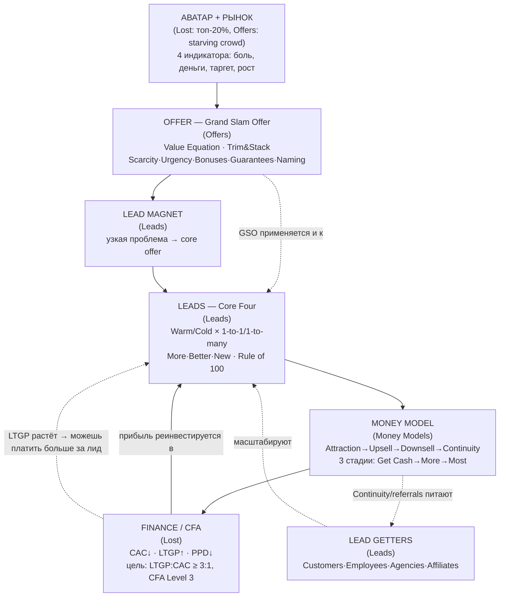

# Карта системы Хормози — синтез 4 книг

> Свод всех разборов (`books/01`–`books/04`) в единую картину: как фреймворки связаны, единый глоссарий, финансовый костяк и диаграмма конвейера. Это фундамент для архитектуры системы скиллов.

---

## 1. Главный «through line» — весь бизнес Хормози на одной схеме

Три книги трилогии отвечают на три последовательных вопроса, а 4-я («Lost») углубляет всё и добавляет финансовый костяк:

| Вопрос | Книга | Ответ |
|---|---|---|
| **Кому** продавать? | Lost (Avatar) + Offers | Идеальному аватару в правильном рынке (starving crowd, топ-20%) |
| **Что** продавать? | $100M **Offers** | Grand Slam Offer (несравнимый оффер) |
| **Кого/как** найти? | $100M **Leads** | Core Four (4 способа рекламы) |
| **Как заставить** купить? | $100M **Money Models** | Последовательность офферов (Attraction→Upsell→Downsell→Continuity) |
| **Как считать деньги?** | Lost (CFA) | CAC / LTGP / PPD → Customer-Financed Acquisition |



**Ключевая петля обратной связи:** Money Model + Offer поднимают **LTGP** → растёт бюджет, который можно потратить на привлечение (**CAC**) → больше лидов → больше клиентов → больше прибыли на реинвест. Это и есть «маховик» (flywheel), который делает бизнес неубиваемым.

---

## 2. Карта пересечений (где книга X питает книгу Y)

| Мост | Откуда | Куда | Суть связи |
|---|---|---|---|
| **GSO → Lead Magnet** | Offers | Leads | Лид-магнит должен быть Grand Slam Offer'ом («работает для free даже лучше»). Value Equation стоит за «big fast value» холодного аутрича. |
| **Гарантии ↔ Attraction-плеи** | Offers | Money Models | Guarantee «If X then Z» = прямой предок Win-Your-Money-Back и Trial-With-Penalty (зеркала друг друга: возврат за выполнение vs плата за невыполнение). |
| **Scarcity/Urgency** | Offers | Leads (CTA) + Money Models | Одни и те же рычаги: в Offers усиливают оффер, в Leads — «reason to act now» в CTA, в Money Models — усиливают continuity/bonuses. |
| **Fraternity Party Planner** | Leads | Offers/Lost | «Придумай reason why» — общий приём для CTA (Leads), believability free-оффера (Lost), naming-Magnet (Offers). |
| **Client-Financed Acquisition** | Money Models + Lost | Leads | 30-дневная окупаемость CAC — цель paid ads в Leads; связывает трафик (Leads) с монетизацией (Money Models). |
| **LTGP:CAC ≥ 3:1** | Leads + Lost | все | Единая метрика здоровья через все книги (в Leads — бенчмарк аутрича/рекламы; в Lost — строгая математика). |
| **Avatar (топ-20%)** | Lost | Offers + Leads | Уточняет «starving crowd» из Offers; переопределяет messaging и путь покупки в Leads. |
| **Value Grid / Offer Stacking** | Lost | Offers + Money Models | Стек из нескольких GSO (Offers) в последовательности (Money Models) = максимизация LTGP. |
| **Affiliate relationships** | Money Models + Leads + Lost | все | Заполняют дыры Money Model (плеи), один из 4 Lead Getters, источник LTGP в offer-stacking. |
| **«Create flow, monetize, add friction»** | Offers | Money Models + Lost | Общий принцип: сначала спрос, потом монетизация (Sales-Fulfillment continuum ↔ «Get flow, monetize flow»). |
| **Maker/Manager** | Lost | Leads (Employees) | Как управлять временем тех, кто делает рекламу/продукт. |

---

## 3. Единый глоссарий (сквозные термины и метрики)

**Финансовые (костяк системы):**
- **CAC** — Cost to Acquire a Customer = полная стоимость привлечения ÷ число клиентов (считать по каналу).
- **GP** — Gross Profit = выручка − прямая стоимость обслуживания ещё одного клиента.
- **LTGP** (= LTV у Хормози) — Lifetime Gross Profit = GP × #транзакций (или GP ÷ churn% для recurring).
- **PPD** — Payback Period = время, когда накопленный GP > CAC.
- **30D Cash / 30D LTV** — деньги с клиента за первые 30 дней (ключ к CFA и Value Grid).
- **CFA** — Customer-Financed Acquisition: клиенты сами оплачивают привлечение следующих.
  - Level 1: 30D GP < CAC (плохо). Level 2: = CAC (кредитка-оборотка). **Level 3: > 2×CAC (цель, удвоение/мес).**
- **Целевой бенчмарк:** **LTGP:CAC ≥ 3:1** (минимум; у автора бывает 30:1, 100:1).

**Оффер (Offers):**
- **Grand Slam Offer (GSO)** — несравнимый оффер (category of one).
- **Value Equation** = (Dream Outcome × Perceived Likelihood) ÷ (Time Delay × Effort & Sacrifice).
- **Trim & Stack** — обрезать до low-cost/high-value, собрать в bundle.
- **5 усилителей:** Scarcity, Urgency, Bonuses, Guarantees, Naming (**M-A-G-I-C**).

**Лиды (Leads):**
- **Engaged Lead** — лид, проявивший интерес (истинный выход рекламы).
- **Lead Magnet** — решение узкой проблемы, обнажающее следующую (для core offer).
- **Core Four** — Warm Outreach / Content / Cold Outreach / Paid Ads.
- **More·Better·New** + **Rule of 100** + **Open to Goal** — масштабирование.
- **4 Lead Getters** — Customers(referrals) / Employees / Agencies / Affiliates.

**Money Model:**
- **Money Model** — продуманная последовательность офферов.
- **4 типа офферов** (12 плей): Attraction (5) / Upsell (4) / Downsell (3) / Continuity (3).
- **3 стадии:** Get Cash → Get More Cash → Get The Most Cash.

**Аватар (Lost):**
- **Avatar refinement** — метод Vista: топ-20% клиентов → 3-5 общих квалификаторов.
- **Value Grid** — нелинейная сетка покупок вместо Value Ladder.

---

## 4. Финансовый костяк — как метрики связывают ВСЕ книги

Всё в системе сводится к одному неравенству и его составляющим:

```
                    LTGP          (↑ Offers: премиум-цена, Trim&Stack, гарантии
   HEALTH  =  ───────────────         Money Models: upsell/continuity/stacking
                    CAC              ↓ Leads: More·Better·New, лид-магнит, лучший канал)

   ЦЕЛЬ: LTGP:CAC ≥ 3:1   И   30-day GP > 2×CAC  (CFA Level 3)
   СКОРОСТЬ: ↓ PPD  → быстрее реинвест → ×4..×8 к темпу роста
```

- **Offers** двигает **числитель** (LTGP↑) через ценность и премиум-цену.
- **Money Models** двигает **числитель** (LTGP↑ через стек офферов) И **скорость** (PPD↓ через up-front cash).
- **Leads** двигает **знаменатель** (CAC↓ через лид-магнит, More·Better·New, лучший канал).
- **Lost/CFA** — приборная панель, которая всё это измеряет и превращает в маховик.

> Вывод: **финансовый слой — не отдельная книга, а позвоночник всей системы.** В архитектуре скиллов он должен быть отдельным переиспользуемым калькулятором, к которому обращаются остальные.

---

## 5. Порядок применения (roadmap для пользователя)

Единый маршрут, собранный из всех книг (от 0 до масштаба):

1. **Рынок + Аватар** — 4 индикатора (Offers) + топ-20% survey (Lost). *Не в bad market, commit to niche.*
2. **Grand Slam Offer** — Value Equation + 5 шагов Trim&Stack + 5 усилителей (Offers).
3. **Lead Magnet** — 7 шагов, GSO для free (Leads).
4. **Первые лиды** — Warm Outreach → Content (Core Four, Leads), Rule of 100.
5. **Money Model** — Attraction→Upsell→Downsell→Continuity, довести CAC-окупаемость до ≤30 дней (Money Models).
6. **Финансы** — посчитать CAC/LTGP/PPD, добить до CFA Level 3 (Lost).
7. **Масштаб** — More·Better·New, Lead Getters, offer-stacking (Value Grid), нанять команду (Leads + Lost).

---

## 6. Предлагаемая архитектура системы скиллов (на основе карты)

Карта показывает: **4 доменных слоя + 1 сквозной финансовый + диспетчер.**

```
.claude/skills/hormozi/                 ← общий «диспетчер» (роутер по задаче)
├── offers/          ← книга 1 + Avatar/Value Grid из книги 4
│     market-scorecard · avatar-refine · value-equation-audit
│     offer-builder (5 шагов) · enhancers (5 рычагов) · namer (MAGIC)
├── leads/           ← книга 3 (+ эталон с GitHub)
│     core-four-planner · lead-magnet-builder (7 шагов)
│     cta-generator · rule-of-100 · lead-getters · roadmap
├── money-models/    ← книга 2 + новые плеи из книги 4
│     model-designer (3 стадии) · offer-play-library (12+7 плей)
│     downsell-flow · offer-stacking (Value Grid)
├── finance/         ← СКВОЗНОЙ (книга 4) — костяк, к нему обращаются все
│     cac-ltgp-ppd-calculator · cfa-diagnostic (3 уровня) · ltgp-cac-check
└── ops/  (опц.)     ← Maker/Manager из книги 4
```

**Принцип диспетчера:** пользователь описывает ситуацию → скилл определяет, где он на roadmap (п.5) → направляет в нужный доменный под-скилл → все считают деньги через общий `finance`.

**Открытый вопрос к обсуждению (перед сборкой):**
- Один «мега-скилл» с под-командами vs система из связанных скиллов? (Карта склоняет к **системе** с общим диспетчером — так гибче и ближе к формату эталона `100m-leads`.)
- Язык скиллов: RU / EN / билингва? (Ты пишешь на RU, но термины — EN.)
- Привязка к твоему домену (Wildberries/`wb-headless`) — делать примеры под селлеров WB или держать универсально?

---
*Карта готова. Следующий шаг — утвердить архитектуру (раздел 6) и собрать скиллы.*
